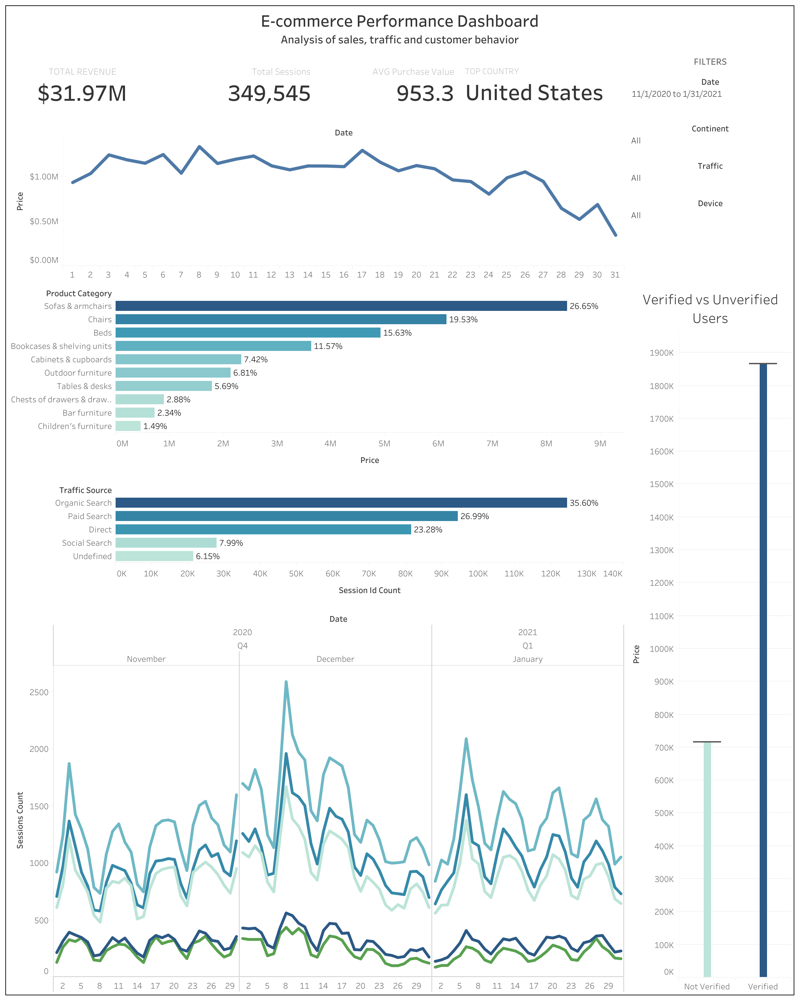

# E-commerce Data Analytics Project

## Live Dashboard
[View Tableau Dashboard](https://public.tableau.com/views/E-commercePerformanceDashboard_17780761009860/E-commercePerformanceDashboard?:language=en-US&:sid=&:redirect=auth&:display_count=n&:origin=viz_share_link)

---

## Project Overview

This project presents an analytical dashboard built in Tableau Public to analyze e-commerce sales performance, traffic sources, and user behavior.

The project combines:
- SQL (Google BigQuery)
- Python data analysis
- Statistical testing
- Interactive Tableau visualizations

## SQL Data Extraction

The dataset was created using SQL joins across multiple Google BigQuery tables:
- sessions
- session parameters
- accounts
- orders
- products

Special attention was paid to selecting appropriate join types in order to preserve all sessions and orders, including data from unregistered users.

---

## Dashboard Features

### Sales Analysis
- Revenue KPIs
- Sales trends over time
- Top-performing product categories
- Regional sales analysis

### Traffic Analysis
- Traffic distribution by source
- Traffic trends by channel
- Correlation analysis between traffic channels

## Statistical Methods Used

- Pearson Correlation Analysis
- Mann-Whitney U Test
- P-value significance analysis
- Distribution analysis
- Correlation analysis between continents, traffic channels, and product categories

### User Behavior Analysis
- Comparison of verified vs unverified users
- Purchase distribution analysis
- Statistical validation using Mann-Whitney U test

---

## Key Insights

- Sales demonstrate several seasonal peaks during high-activity periods
- Traffic channels show strong positive correlations
- No statistically significant difference was found between verified and unverified users regarding purchase amounts
- Organic and direct traffic dominate user acquisition

---

## Technologies Used

### Data Extraction
- Google BigQuery
- SQL

### Data Analysis
- Python
- Pandas
- NumPy
- SciPy

### Visualization
- Matplotlib
- Seaborn
- Tableau Public

---

## Dashboard Preview

---

## Author

Ivan Mykhailov  
Junior Data Analyst / Python Developer
